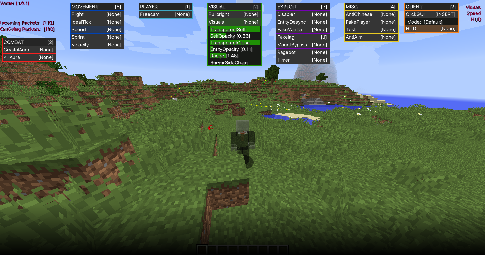

# Winter ❄️ - Anarchy Forge Mod


*Winter GUI showcasing the available modules*


## About

Winter is an old unfinished anarchy forge mod that serves as a utility client, designed to enhance your Minecraft experience. 

## Disclamer

Some features is broken at this state of development since it hasnt been maintained for over 8 months so feel free to contribute/use the client as base for your own

## Why?

We're releasing Winter because, over time, sqlskid and I have shifted our focus to other projects. As a result, we're no longer actively maintaining this client.

### Installation

To install the Winter forge mod, follow these concise steps:

1. **Forge**: Ensure that you have [Minecraft Forge](https://files.minecraftforge.net/) installed.
2. **Download**: Download the Winter build [here](https://github.com/pvpb0t/Winter/releases/download/1.0.1/winter-1.0.1-release.jar).
3. **Mods folder**: Locate your Minecraft 'mods' folder:
   - Windows: `%APPDATA%\.minecraft\mods`
   - macOS: `~/Library/Application Support/minecraft/mods`
   - Linux: `~/.minecraft/mods`
4. **Install**: Place the downloaded Winter jar file into the 'mods' folder.
5. **Launch**: Start Minecraft with the Forge profile, and Winter will be loaded automatically.

## Build Instructions

To build Winter using Gradle, follow these simple steps:

For Windows users:

```
gradlew build
```

For Unix users:
```
./gradlew build
```

## Further Development

Our Winter client has served as a foundation for other projects, such as the private and actively maintained client Demonware. Developed by [PotatoSUS](https://github.com/PotatoSUS) and [JohnShiozo](https://github.com/JohnShiozo), Demonware leverages the core features of Winter while adding their own unique enhancements and improvements.

## Credits

-  Me - Developer
- [virtualbox](https://github.com/sqlskid) - Developer
- [popbobik](https://github.com/2u9) - Cool guy
